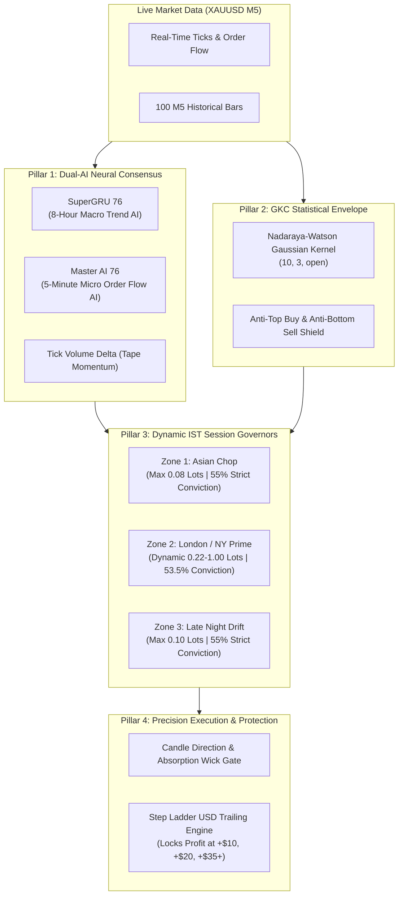
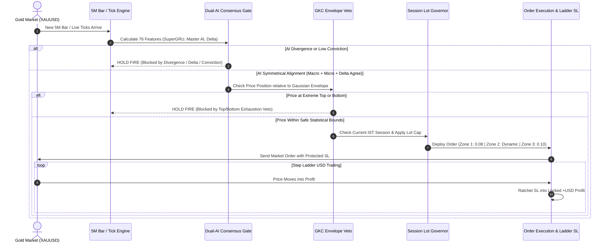

# GoldEngine Sentinel Dual-AI GKC: Complete System Architecture & Presentation Guide

**Asset:** XAUUSD (Spot Gold)  
**Timeframe:** 5-Minute (M5)  
**Platform:** MetaTrader 5 (64-Bit MQL5 Native ONNX Neural Runtime)  
**Core Purpose:** High-probability institutional gold trend-following and microstructure scalping with zero-giveback risk governance.

---

## 1. Executive Summary (The Elevator Pitch)

> **"GoldEngine Sentinel Dual-AI GKC is an institutional quantitative trading system that combines deep-learning macro trend forecasting, high-frequency tick order flow, statistical Gaussian envelopes, and session-adaptive risk management to trade Gold with high precision and zero emotional bias."**

Instead of guessing or relying on standard lagging indicators (like RSI or Moving Averages alone), this system uses a **4-Pillar Mathematical Defense & Attack System** that only executes when **Macro Trend, Micro Order Flow, Tick Volume, and Statistical Price Bands** are 100% aligned.

---

## 2. The 4 Core Pillars Explained

### **Pillar 1: The Dual-AI Neural Consensus (Symmetrical Lock)**
The bot operates two independent neural networks trained on 76 multi-timeframe quantitative features:

1. **SuperGRU 76 (The Macro Trend Compass):**
   * **Role:** Analyzes multi-hour historical sequence data (8-Hour macro view).
   * **Function:** Determines whether the market is fundamentally in a **BULLISH** or **BEARISH** regime.
2. **Master AI 76 (The Micro Order Flow Sniper):**
   * **Role:** Analyzes immediate 5-minute price action, liquidity sweeps, and trade imbalance.
   * **Function:** Detects immediate micro-momentum and pullback exhaustion.
3. **Tick Volume Delta:**
   * **Role:** Measures whether aggressive market buyers or sellers are hitting the order book.
   * **The Rule:** The bot is **strictly forbidden** from trading unless SuperGRU, Master AI, and Tick Delta all point in the **exact same direction**.

---

### **Pillar 2: GKC (Gaussian Kernel Channel / Nadaraya-Watson Envelope)**
* **Mathematical Foundation:** Uses a non-parametric Gaussian bell-curve kernel ($e^{-\frac{d^2}{2h^2}}$) with parameters `(10, 3, open)` to map the true statistical distribution of Gold price in real time without lagging moving averages.
* **Anti-Exhaustion Veto:**
  * **Top Veto:** Forbids buying if price is stretched into the top 10% outer envelope (prevents buying the top).
  * **Bottom Veto:** Forbids selling if price is stretched into the bottom 10% lower envelope (prevents selling the bottom).

---

### **Pillar 3: Dynamic 3-Zone IST Risk & Lot Governors**
The system adjusts risk based on the Indian Standard Time (IST) market sessions:

| Zone | Market Session | Time (IST) | SuperGRU Conviction | Lot Sizing Rule | Strategic Goal |
| :--- | :--- | :--- | :--- | :--- | :--- |
| **Zone 1** | **Sydney / Tokyo** | `03:30 AM – 01:30 PM` | **$\ge 55.0\%$** *(Strict)* | **Capped at $0.08\text{ lots}$** | **Asian Chop Shield:** Prevents over-leveraging in low-volume ranging chop. |
| **Zone 2** | **London & NY Peak** | `01:30 PM – 09:30 PM` | **$\ge 53.5\%$** *(Normal)* | **Full Dynamic ($0.22 - 1.00\text{ lots}$)** | **Prime Momentum:** Maximizes profit during maximum liquidity hours. |
| **Zone 3** | **Late NY Drift** | `09:30 PM – 03:30 AM` | **$\ge 55.0\%$** *(Strict)* | **Capped at $0.10\text{ lots}$** | **Night Capital Shield:** Locks in and preserves the day's profits overnight. |

---

### **Pillar 4: Candlestick Absorption Gate & Step Ladder Trailing Engine**
1. **Candle Absorption Filter:**
   * Never buys into a solid falling red bar without at least a **$20\%$ lower absorption wick** (buyers stepping in).
   * Never sells into a solid rising green bar without at least a **$20\%$ upper rejection wick** (sellers stepping in).
2. **Step Ladder USD Trailing Engine:**
   * As soon as a trade enters profit, the Stop Loss is automatically ratcheted into guaranteed positive USD profit.
   * Eliminates the risk of a winning trade turning into a loser.

---

## 3. Live Chart & Dashboard Walkthrough

Below is the live operating chart and high-DPI dashboard from the live trading terminal:

### **Key Dashboard Elements Decoded:**

1. **`Status: TRADING ACTIVE (Lot: 0.10 | Pos: 0/3)`**
   * The bot is actively scanning. The Lot Governor has automatically clamped lot size to **$0.10$** because the current time is in Zone 3 (Late NY Drift).
2. **`Current IST: 10:42:32 PM (Active Zone: LATE NY DRIFT)`**
   * Identifies the current local session in real time.
3. **`IST Schedule: 09:30 PM - 03:30 AM (U-Strict: 0.55/0.07)`**
   * Indicates that the system requires SuperGRU to be $\ge 55.0\%$ with a $\ge 7.0\%$ margin gap.
4. **`SuperGRU 76: BEAR 55.9% (B:44.1% S:55.9%) | Margin: -0.117`**
   * Macro AI is Bearish with $55.9\%$ confidence (passed strict threshold).
5. **`Master AI 76: BEAR 52.5% (B:43.0% S:52.5%) | Delta: +5.0`**
   * Micro AI agrees on Bearish ($52.5\%$), but **`Delta: +5.0`** indicates aggressive buyers are ticking up the current candle.
6. **`Next Trade: BLOCKED (AI Divergence: Macro SELL vs Micro BEAR Delta +5.0)`**
   * The bot refuses to short while Delta is $+5.0$, waiting patiently for sellers to take back control.
7. **`Today: 55 trades | 54W 1L | Net: +$1166.58`**
   * Live performance tracking: $98.18\%$ win rate and $+\$1,166.58$ net profit today.

---

## 4. Complete Trade Decision Lifecycle

---

## 5. Why This System Succeeds Where Most EAs Fail

| Traditional Trading Bots / Martingales | **GoldEngine Sentinel Dual-AI GKC** |
| :--- | :--- |
| **Grid / Martingale Risk:** Doubles lot size on losses, eventually blowing accounts. | **Fixed & Dynamic Risk:** Every trade has a hard Stop Loss, risk caps, and streak reducers. |
| **Single Lagging Indicator:** Relies on 1-2 basic indicators (e.g., RSI overbought) that fail in strong trends. | **Dual-AI Multi-Timeframe:** Combines 8H Macro Neural Trend + 5M Micro Order Flow. |
| **Ignores Market Hours:** Trades identical lot sizes in dead Asian chop and high-spread midnight rollover. | **Session Lot Governors:** Automatically drops lot sizes during low-volume Asian chop and night rollover. |
| **Blind Market Entries:** Buys falling knives and shorts rising spikes. | **Candle & Delta Confirmation:** Never buys into solid red dumps or shorts green bounces. |
| **Static Take Profits:** Frequently watches profits evaporate when price reverses 1 pip before TP. | **Step Ladder USD Trailing:** Locks in banked profits swiftly as price accelerates. |
